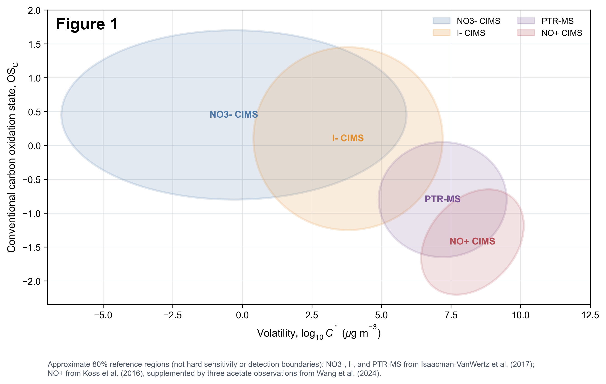

# PFAS CIMS Chemical-Space PhD Exam

## Background to Question

The current EPA PFASSTRUCTV6 list contains 21,028 structures [1], yet only a very limited subset has been reported in air measurements using chemical ionization mass spectrometry (CIMS) [5-8]. The goal is to determine whether this reflects limitations of specific reagent-ion chemistries, including NO+, O2-, I-, and NO3- CIMS, or other factors. Start with Figure 1, which maps conventional carbon oxidation state against volatility for NO3- CIMS, I- CIMS, PTR-MS, and NO+ CIMS [2-4]. Overlay previously measured PFAS in this two-dimensional domain, extend the analysis to a broader range of species from the EPA list, and determine how additional PFAS that have not yet been reported might be detected.

## Questions

1. **Where do previously measured PFAS fall in the OSc versus volatility domain shown in Figure 1?** Conduct a literature review and place PFAS previously measured by I- CIMS and positive-ion NO+/O2+ CIMS in this space using OPERA-estimated volatility. Is there an offset to match the space with the previously measured PFAS species?

2. **Which oxidation-state coordinate is more informative?** Repeat the analysis in Question 1 by replacing the conventional CHO-based carbon oxidation state with the PFAS-adjusted nominal oxidation state of carbon reported by Lu et al. [10]. Test whether including fluorine/sulfur improves agreement with reported detection, and explain why the added F/C relationship in calculating oxidation state may or may not help align PFAS data with literature values using traditional atmospheric datasets.

3. **What is missing from the supplied PFAS panel?** Download the spreadsheet from GitHub, which contains a subset of EPA PFASSTRUCTV6 [1], and plot those compounds in Figure 1. Compare their distribution with the measured species and add additional air-relevant PFAS from the full PFASSTRUCTV6 list where appropriate.

4. **Where might O2- CIMS fall in this figure?** Evaluate its likely region using the limited published PFAS dataset [8]. Identify what conclusions are and are not supported by the available compounds, and discuss what additional measurements would be needed to define the region more confidently.

5. **For PFAS that are volatile enough to remain in air but have not been reported, why might they have been missed?** Which currently underreported PFAS categories could realistically be measured in indoor and outdoor gas-phase samples?

*Please limit your full response to no more than 5 pages. Question 5 should take a substantial portion of your answers.*

## Provided Files

- [`figure1_cims_chemical_space_regions.png`](figure1_cims_chemical_space_regions.png): the 300 dpi, high-resolution Figure 1 used in the v2 handout.
- [`pfas_compounds_300.xlsx`](pfas_compounds_300.xlsx): a 300-compound teaching subset of EPA PFASSTRUCTV6, with category summary and data-dictionary worksheets.

## References and Data Notes

1. U.S. Environmental Protection Agency. (2026). *CompTox Chemicals Dashboard: PFAS Structure List (PFASSTRUCTV6; January 2026)*, 21,028 structures. Accessed July 29, 2026. [PFASSTRUCTV6 data page](https://comptox.epa.gov/dashboard/chemical-lists/PFASSTRUCTV6)
2. Isaacman-VanWertz, G. et al. (2017). Using advanced mass spectrometry techniques to fully characterize atmospheric organic carbon: current capabilities and remaining gaps. *Faraday Discussions*, *200*, 579-598. [doi:10.1039/C7FD00021A](https://doi.org/10.1039/C7FD00021A)
3. Koss, A. R. et al. (2016). Evaluation of NO+ reagent ion chemistry for online measurements of atmospheric volatile organic compounds. *Atmospheric Measurement Techniques*, *9*, 2909-2925. [doi:10.5194/amt-9-2909-2016](https://doi.org/10.5194/amt-9-2909-2016)
4. Wang, S. et al. (2024). Emission characteristics of reactive organic gases (ROGs) from industrial volatile chemical products (VCPs) in the Pearl River Delta (PRD), China. *Atmospheric Chemistry and Physics*, *24*, 7101-7121. [doi:10.5194/acp-24-7101-2024](https://doi.org/10.5194/acp-24-7101-2024)
5. Riedel, T. P. et al. (2019). Gas-phase detection of fluorotelomer alcohols and other oxygenated per- and polyfluoroalkyl substances by chemical ionization mass spectrometry. *Environmental Science & Technology Letters*, *6*, 289-293. [doi:10.1021/acs.estlett.9b00196](https://doi.org/10.1021/acs.estlett.9b00196)
6. Davern, M. J. et al. (2024). External liquid calibration method for iodide chemical ionization mass spectrometry enables quantification of gas-phase per- and polyfluoroalkyl substances (PFAS) dynamics in indoor air. *Analyst*, *149*, 3405-3415. [doi:10.1039/D4AN00100A](https://doi.org/10.1039/D4AN00100A)
7. Gagan, S. et al. (2026). Real-time identification and quantification of per- and polyfluoroalkyl substances using high-resolution time-of-flight chemical ionization mass spectrometry with positive reagent ions. *Analytical Chemistry*, *98*, 124-133. [doi:10.1021/acs.analchem.5c02489](https://doi.org/10.1021/acs.analchem.5c02489)
8. Hu, Y. et al. (2026). Feasibility study of superoxide chemical ionization mass spectrometry (O2- CIMS) for real-time gas-phase measurements of per- and polyfluoroalkyl substances (PFAS). *Analyst*, *151*, 3418-3429. [doi:10.1039/D5AN01352F](https://doi.org/10.1039/D5AN01352F)
9. Mansouri, K. et al. (2018). OPERA models for predicting physicochemical properties and environmental fate endpoints. *Journal of Cheminformatics*, *10*, 10. [doi:10.1186/s13321-018-0263-1](https://doi.org/10.1186/s13321-018-0263-1)
10. Lu, W. et al. (2026). Exploring the fluorinome of PFAS-impacted groundwater using 21 tesla FT-ICR mass spectrometry. *Water Research*, *288*, 124698. [doi:10.1016/j.watres.2025.124698](https://doi.org/10.1016/j.watres.2025.124698)

